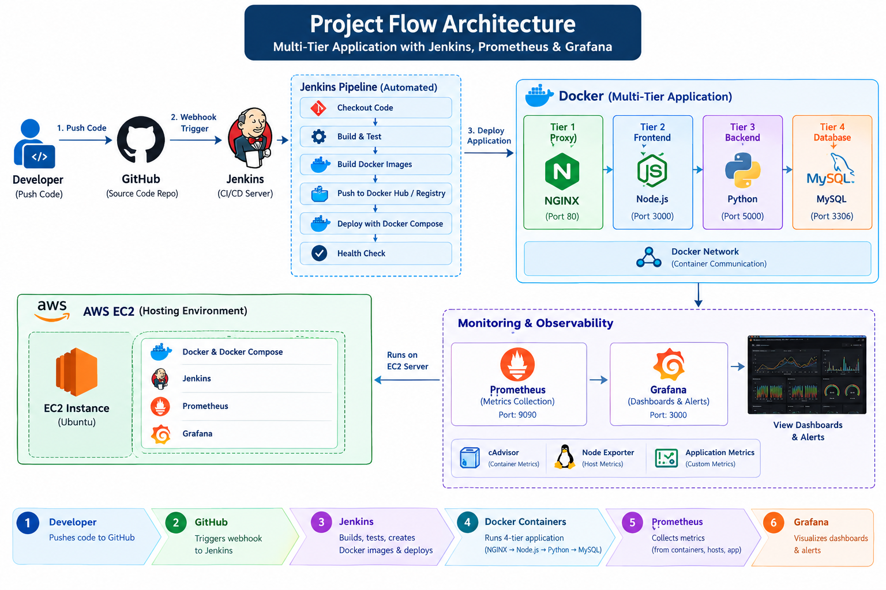

# Multi-Tier Docker Application — CI/CD & Monitoring

## 📌 Project Summary

A **4-tier containerized application** deployed using Docker and Docker Compose, integrated with **Jenkins for automated CI/CD** and **Prometheus + Grafana for monitoring and observability**.

### Application Tiers

- **Tier 1:** NGINX — Reverse Proxy
- **Tier 2:** Node.js — Frontend
- **Tier 3:** Python — Backend/API
- **Tier 4:** MySQL — Database

The complete application and DevOps stack can be hosted on an **AWS EC2** server.

---

## 🏗️ Project Architecture



### Project Flow

```text
Developer
    ↓ git push
GitHub
    ↓ Webhook
Jenkins
    ↓
Checkout → Build & Test → Build Docker Images
    ↓
Docker Compose Deployment
    ↓
NGINX → Node.js → Python → MySQL
    ↓
Prometheus → Grafana
    ↓
Metrics, Dashboards & Alerts
```

---

## 🔄 CI/CD Workflow

1. Developer pushes code to GitHub.
2. GitHub webhook automatically triggers Jenkins.
3. Jenkins checks out the latest source code.
4. Jenkins runs validation/tests.
5. Jenkins builds Docker images.
6. Jenkins deploys the application using Docker Compose.
7. Jenkins performs health checks.
8. Prometheus collects infrastructure/container/application metrics.
9. Grafana displays monitoring dashboards.

The objective is to make deployment **automated instead of manually rebuilding and restarting containers**.

---

## 📊 Monitoring & Observability

### Prometheus

Prometheus collects metrics from:

- Docker containers using **cAdvisor**
- Linux host using **Node Exporter**
- Application endpoints using Prometheus-compatible application metrics

### Grafana

Grafana connects to Prometheus and provides dashboards for:

- CPU and memory usage
- Disk and network usage
- Container performance
- Application/API metrics
- Service health

---

## 🛠️ Technology Stack

| Category | Technology |
|---|---|
| Frontend | Node.js |
| Backend | Python |
| Database | MySQL |
| Reverse Proxy | NGINX |
| Containerization | Docker |
| Orchestration | Docker Compose |
| Source Control | Git & GitHub |
| CI/CD | Jenkins |
| Monitoring | Prometheus |
| Visualization | Grafana |
| Container Metrics | cAdvisor |
| Host Metrics | Node Exporter |
| Cloud | AWS EC2 |

---

## 📁 Project Structure

```text
project/
├── frontend/
├── backend/
├── proxy/
├── database/
├── monitoring/
│   ├── prometheus/
│   └── grafana/
├── docker-compose.yml
├── Jenkinsfile
├── .gitignore
└── README.md
```

---

## 🚀 Main Components

### Docker Compose

Manages the application and monitoring services:

```text
NGINX | Node.js | Python | MySQL
Prometheus | Grafana | cAdvisor | Node Exporter
```

### Jenkins

Automates:

```text
GitHub → Build → Test → Docker Build → Deploy → Health Check
```

### Prometheus + Grafana

```text
Application / Host
        ↓
 Exporters / Metrics
        ↓
   Prometheus
        ↓
     Grafana
        ↓
 Dashboards & Alerts
```

---

## 🔐 Security Practices

- Store passwords and secrets using environment variables/Jenkins Credentials.
- Do not commit `.env` files or credentials to GitHub.
- Keep MySQL inaccessible from the public Internet.
- Restrict Jenkins, Prometheus and Grafana using firewall/security-group rules.
- Use persistent Docker volumes for database and monitoring data.

---

## ⚠️ Challenges Faced & Solutions

During the implementation of this project, I faced several real-world DevOps challenges and resolved them through troubleshooting and testing.

* **Docker container communication:** Configured Docker networks so NGINX, Node.js, Python, and MySQL could communicate correctly.
* **Service startup dependency:** Handled service dependencies and health checks to ensure the application starts in the correct order.
* **Jenkins–Docker integration:** Configured Jenkins with the required Docker permissions so the CI/CD pipeline could build and deploy containers automatically.
* **GitHub Webhook issues:** Troubleshot webhook configuration and Jenkins trigger settings to achieve automatic pipeline execution after code pushes.
* **Docker image/build failures:** Investigated build logs, dependency errors, and configuration issues during image creation.
* **Container health and deployment failures:** Used Docker logs, container status, and health checks to identify and resolve failed deployments.
* **Prometheus target configuration:** Configured Prometheus exporters and scrape targets to collect container and host-level metrics.
* **Grafana dashboard connectivity:** Connected Grafana with Prometheus and verified that metrics were correctly displayed.
* **Environment and secrets management:** Avoided hardcoding sensitive credentials by using environment variables and Jenkins credentials.
* **Persistent database storage:** Configured Docker volumes to prevent MySQL data loss when containers are recreated.

### 💡 Key Learning

This project helped me understand that DevOps is not only about configuring tools, but also about **troubleshooting, automation, monitoring, security, and continuous improvement**.


## 🎯 Project Outcome

This project demonstrates practical knowledge of:

**Docker → Docker Compose → GitHub → Jenkins CI/CD → AWS EC2 → Prometheus → Grafana**

It provides an end-to-end **automated deployment and monitoring workflow** for a multi-tier application.

> **Build → Automate → Deploy → Monitor**
